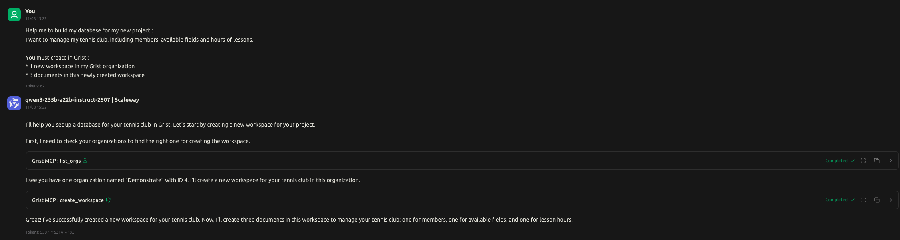
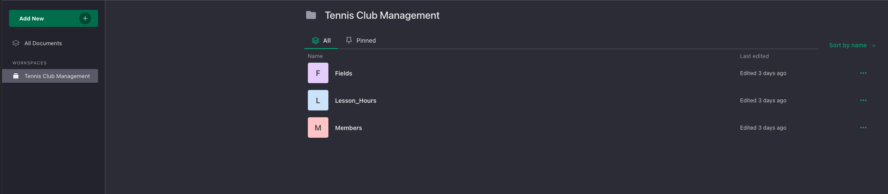

# Grist MCP Server

[⚠️] Work in progress, not ready for production yet.  
[⚠️] TODO: Must minimize prompts and responses to limit tokens usage (around 8000 tokens for the sample request)  
[⚠️] Disclaimer: This is just a for-fun project, not actively maintained, but happy to share and contributions are welcome !

Functions:
* ✅ `list_orgs` : List all organizations 
* ✅ `create_workspace`: Creates a new workspace in organization 
* ✅ `create_new_docs`: Creates one or more documents in workspace
* ☑️ `query_sql`: Query SQL
* ☑️ `add_record`: Add a record in a document
* ☑️ `get_record`: Get a record in a document
* ☑️ `add_columns_to_table`: Add columns to a table

## Examples

Prompt:
> Creates a new workspace named "Happy customer" in my organization

## Getting started

1. Clone the project 
```bash
$ git clone https://github.com/quentinchampenois/grist-mcp.git 
$ cd grist-mcp
```

2. Build the server
```bash
$ go mod tidy
$ go build -o grist-mcp-server
```
💡 Binary `grist-mcp-server` must be present in `$PATH` to be callable 

🚀 MCP Server is ready to use ! But how ?  
If you try to run it directly `$ ./grist-mcp-server` process will run but nothing happens, and it's the expected behaviour.

## Use @modelcontextprotocol/inspector to debug

Package `@modelcontextprotocol/inspector` starts a WebUI to test directly your MCP server, test output based on provided input.

### Requirements

* Node

### How to

Start inspector as following

```bash
$ npx @modelcontextprotocol/inspector grist-mcp-server
```

Access WebUI at http://localhost:6274/?MCP_PROXY_AUTH_TOKEN=<GENERATED_TOKEN>

## Configure client using Cherry studio and Scaleway AI provider

In this example we will use [Cherry Studio](https://github.com/CherryHQ/cherry-studio) as client and [model qwen3-235b-a22b-instruct-2507 from Scaleway provider](https://www.scaleway.com/en/docs/generative-apis/quickstart/). 

### Requirements
* Configure account on Scaleway and generate API token (~5 minutes)
* Cherry studio installed

### Configure Qwen3-235b from Scaleway on Cherry Studio

Open Cherry Studio and configure the Scaleway provider: (cf: README on [another project for full chery studio steps](https://github.com/Quentinchampenois/shell-history-mcp-server?tab=readme-ov-file#configure-client-using-cherry-studio-and-scaleway-ai-provider))

__🚀 Once Cherry studio let's give a try with a basic prompt__

``` 
I want to manage my tennis club within Grist, including: members, available fields and hours of lessons. 

You must create in Grist : 
* 1 new workspace in my Grist organization
* 3 documents in this newly created workspace
```

Example: 

Prompt: 


Result:


## Extra

* Source Cherry studio: https://github.com/CherryHQ/cherry-studio
* Source Scaleway AI (Generative API): https://www.scaleway.com/en/docs/generative-apis/quickstart/
* Go MCP SDK: https://github.com/modelcontextprotocol/go-sdk/tree/main
* MCP Inspector: https://modelcontextprotocol.io/docs/tools/inspector